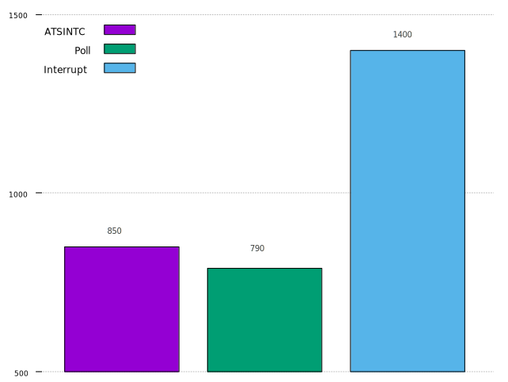

# Ethernet Transmit Line Speed Test

We evaluated the ethernet transmit line speed in three modes. The performance test indicator is the minimum bytes sent in each transaction that can reach line speed.

## Three modes

The transmit transaction starts with submitting a buffer. The DMA will move the data in buffer to ethernet. Each transmit transaction needs a buffer descriptor so we cannot start transactions infinitly. We need to recycle the buffer descriptors.

### Poll

In this mode, it will start transactions once there is buffer descriptor. When there is no buffer descriptor it will recycle the used buffer descriptors.

### Interrupt

In this mode, once the interrupt signal is high, the interrupt handler will recycle the used buffer descriptors.

### ATSINTC

In this mode, there two coroutines, one start a transaction constantly but it will yield the CPU after there is no free buffer descriptor, the other recycles the used buffer descriptors. The recycle coroutine will be waked up by the ATSINTC.

## How to test

### Run the test on FPGA

`make TEST=axinet run FEATURES=****** MTU=***`

FEATURES can be one of them:
1. `transmit_line_speed_poll`
2. `transmit_line_speed_intr`
3. `transmit_line_speed_atsintc`

### Run the receiver on PC

`python receiver.py *** ***`

The first argument is mode, the second argument is MTU.

## Result

line_speed: 970Mbit/sec
| Mode      | minimum bytes|
| --------- | ------------ |
| Poll      | 790          |
| Interrupt | 1400         |
| ATSINTC   | 850          |

